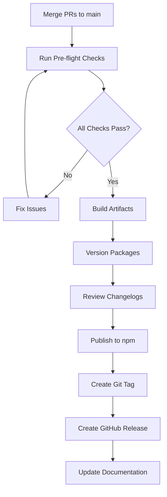

# Release Process Guide

> Developer documentation for the Lumia DS release workflow.

## Overview

Lumia DS uses a structured release process with:

- **Changesets** for version management and changelog generation
- **Playwright** for visual regression testing
- **Vitest** for unit and interaction testing
- **GitHub Actions** for CI/CD pipelines

## Quick Commands

| Purpose | Command |
|---------|---------|
| Create changeset | `pnpm changeset` |
| Version packages | `pnpm version-packages` |
| Publish to npm | `pnpm release` |
| Run all tests | `pnpm test` |
| Run visual tests | `pnpm test:visual` |

## Release Workflow

## Pre-Release Checklist

Before releasing:

1. **Code Quality**
   - `pnpm lint` — ESLint checks
   - `pnpm type-check` — TypeScript validation

2. **Testing**
   - `pnpm test` — Unit tests (75% coverage minimum)
   - `pnpm test:visual` — Visual regression

3. **Build**
   - `pnpm build` — All packages
   - `pnpm storybook:build` — Storybook verification

## Detailed Guide

For the complete step-by-step release checklist, see:
- **[RELEASE.md](../RELEASE.md)** — Full release checklist with all commands

## Related Documentation

- [CONTRIBUTING.md](../CONTRIBUTING.md) — Contributor workflow
- [qa-test-plan.md](./qa-test-plan.md) — Testing strategy
- [qa-component-checklist.md](./qa-component-checklist.md) — Component QA
